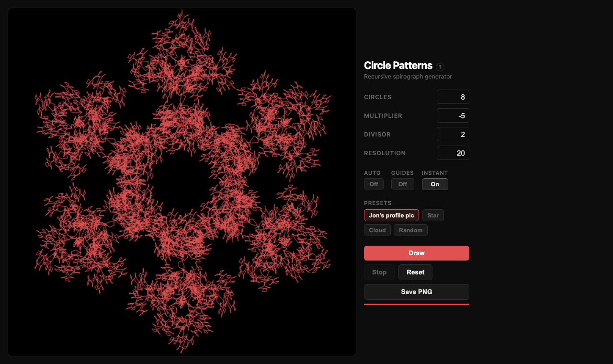
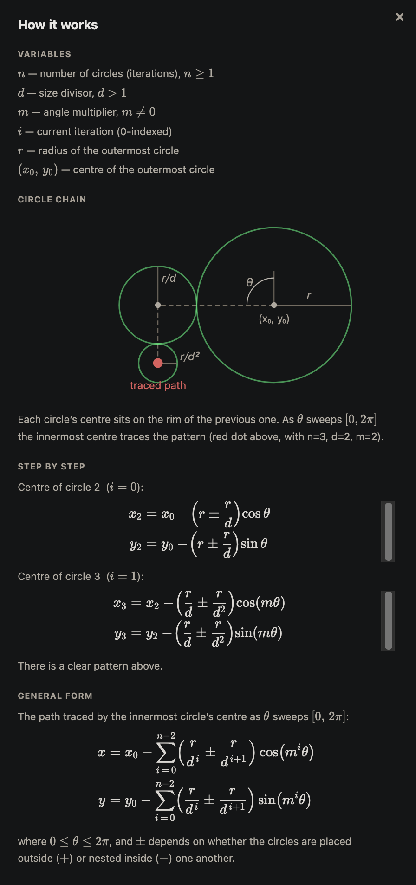
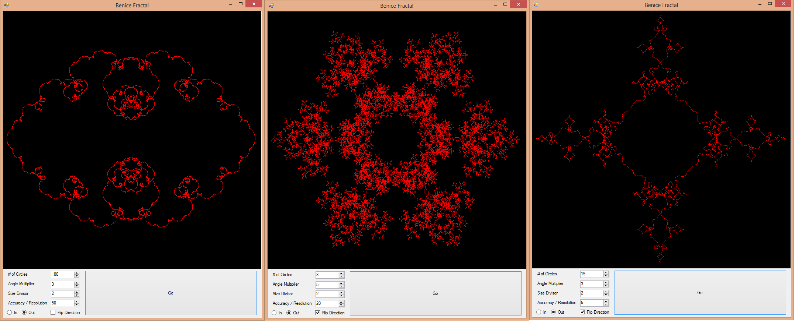
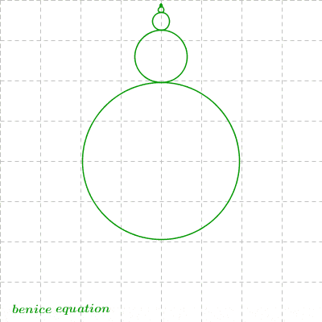

# Circle Patterns

An interactive spirograph generator. I originally built this as a C# desktop app in high school after stumbling across a GIF of something similar, and recently ported it to run in the browser.

## Web version

The math behind how the circles relate to each other is in the **?** overlay. Hit the button in the top-left of the sidebar to see the full derivation in LaTeX, or view the [original handwritten version](images/explanation.jpg).

## Original desktop app (C#)

Built with C# and WinForms on .NET.

## Credit

Inspired by the [benice equation](http://benice-equation.blogspot.ca/).

